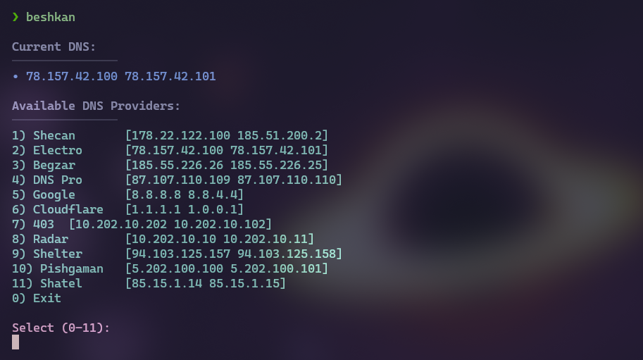

# 🔧 DNS Changer for Linux (NetworkManager-based)

A simple Go tool that automatically detects your active network connection and replaces its DNS servers using **NetworkManager (`nmcli`)**.  
This project also sends **desktop notifications** after successful DNS change using `notify-send`.

---

## ✨ Features

- 🔍 Automatically detects your active connection
- 📦 Replaces previous DNS with custom ones
- ❌ Disables automatic DNS (ignore-auto-dns)
- 🔄 Restarts connection automatically
- 📢 Sends desktop notification after update
- 🐧 Built specifically for Linux systems using NetworkManager

---

## 🧪 Example

When you run the tool:


## 🛠️ Installation

### 1. Install Dependencies

Make sure `NetworkManager` and `notify-send` are available on your system.

#### On Ubuntu/Debian:
```bash
sudo apt install network-manager libnotify-bin
```

#### On Arch Linux:
```bash
sudo pacman -S networkmanager libnotify
```

---

### 2. Clone and Build

```bash
git clone https://github.com/itpourya/beshkan.git
cd beshkan/cmd
go build -o change-dns main.go
```

---

## 🚀 Usage

Run the tool with **sudo**:

```bash
sudo ./beshkan
```

💡 It will:
- Detect the active connection
- Replace existing DNS
- Disable auto-DNS
- Restart the connection
- Notify you on the desktop

---

## 🔧 Configuration

To change the DNS addresses, edit the `configs/config.go` file

For advanced usage, you could extend the program to take CLI arguments.

---

## 📁 Optional: Add to PATH

To make the command available globally:

```bash
sudo cp beshkan /usr/local/bin/
```

Then you can run it from anywhere with:

```bash
sudo beshkan
```

---

## 📢 Notification Support

This tool uses `notify-send` to push a desktop notification upon success or failure.

Make sure:
- You're running in a graphical environment (Wayland/X11)
- `libnotify-bin` is installed

---

## 🧰 Dependencies

- [Go](https://golang.org/doc/install) (>=1.18)
- `nmcli` (from NetworkManager)
- `notify-send` (from `libnotify`)

---

## 📝 License

MIT License. Feel free to use, modify, and distribute.

---

## 🙋‍♂️ Author

Developed by [Pourya Samimi](https://github.com/itpourya)  
